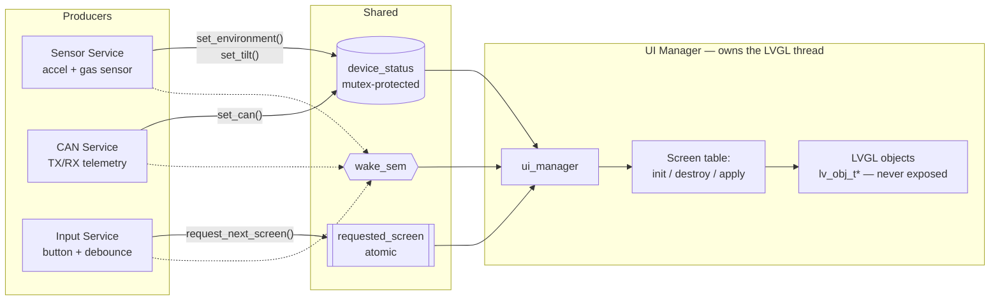

# FRDM-MCXN236 Sensor Hub — UI/Threading Architecture

This document describes the target architecture for how the LVGL UI, sensors, CAN, and
input coexist as separate RTOS threads without racing each other or leaking LVGL
internals outside the UI. It complements `ROADMAP.md` (which tracks *what's done*) by
capturing *how the pieces fit together*.

## Problem today

Everything currently runs in `main()`'s single loop: it polls a button, calls an LVGL
screen-change helper directly, then `lv_timer_handler()`, then sleeps. There's no
dedicated LVGL thread, no sensor/CAN thread, no mutex anywhere, and critically **no
component ever pushes live data into a screen's widgets** — the exported UI just sits
there with its static SquareLine placeholder text. That's the gap this architecture
closes, ahead of wiring up the real sensor and CAN work.

## Component map

Nothing outside the `UI Manager` box ever holds an `lv_obj_t*`. Producers only ever
call the manager's opaque setter API and touch `device_status`/`wake_sem` — they never
`#include` a screen header.

## Components

### 1. UI Manager (`ui_manager`)

Owns and is the **only** code that touches `lv_obj_t*`. Responsibilities:

- Runs the dedicated LVGL thread (the one place `lv_timer_handler()` is called).
- Holds the **screen table**: for each of the 6 screens (Splash, Overview, Tilt,
  Environment, Can, Power), a triple of `{init, destroy, apply}` functions plus the
  generated root-object pointer.
- Owns screen switching: destroy the outgoing screen's objects, lazily init the
  incoming one, load it, then immediately "hydrate" it from the latest
  `device_status` snapshot so it never paints blank.
- Exposes an opaque API (setters + navigation request) — this is the *only* header
  any non-UI component includes.

Two SquareLine-generated behaviors already do half this work and should be reused, not
reimplemented:
- The generated screen-change helper already lazily calls a screen's `init()` when its
  root pointer is `NULL`.
- Every generated screen's `destroy()` already nulls its own root pointer and every
  child widget pointer after deleting them.

So "lazy load/destroy" is mostly *correct sequencing* of existing generated calls, not
new LVGL logic.

### 2. Per-screen adapters

One small hand-written module per screen (`ui_adapter_<screen>`), each translating
`device_status` fields into calls on *that screen's* widgets (`lv_label_set_text`,
`lv_slider_set_value`, etc.). These are the only files besides `ui_manager` allowed to
`#include` a generated `screens/ui_scr<Name>.h`.

This split exists because `screens/*.c` are regenerated wholesale on every SquareLine
re-export — hand-written logic must live in new files that survive a re-export, never
inside the generated ones.

An adapter's `apply(state)` function only ever runs while its screen is the active one
— inactive screens do zero work.

### 3. Sensor Service

Owns sampling of the accelerometer + the custom gas sensor (ROADMAP §3/§4/§5). Computes
*derived* UI-relevant state (status enum: OK/WARN/ERROR against thresholds; not raw
ADC counts) once, and pushes it into `device_status` via the UI Manager's setters. Also
the natural place to maintain the raw `sensor_snapshot` the CAN service reads from.

### 4. CAN Service

Owns the FlexCAN TX/RX (ROADMAP §6): reads the sensor snapshot, packs/sends telemetry
frames, and pushes CAN-relevant display fields (loopback status, frame id, tx interval,
tx/rx counters) into `device_status`.

### 5. Input Service

Owns the physical button: GPIO interrupt → debounce → a navigation request. Never
touches LVGL or `device_status`'s data fields directly — it only requests a screen via
the UI Manager's navigation API. This is also the extension point for any future input
source (e.g. a second button, or an accelerometer-tap wake gesture) — each is just
another producer that calls the same navigation API.

## The shared `device_status`

One flat struct, one mutex, everyone-reads-everyone-writes-their-own-fields:

| Field group | Written by | Read by | Screen(s) |
|---|---|---|---|
| `uptime_s` | main/sensor service | UI Manager | Overview |
| `overall_status`, `mq_status`, `can_status`, `tilt_status` | Sensor/CAN services | UI Manager | Overview |
| `tilt_x/y/z` | Sensor service | UI Manager | Tilt |
| `env_value`, `env_unit`, `env_sensor_name`, `env_channel`, `env_voltage`, `env_status` | Sensor service | UI Manager | Environment |
| `can_loopback_ok`, `can_frame_id`, `can_tx_interval_ms`, `can_tx_count` | CAN service | UI Manager | Can |
| `active_screen` | UI Manager only | (diagnostic) | — |

**Flat, not nested per-screen** — deliberate: since there's a single mutex over the
whole struct, nesting into per-screen sub-structs buys no locking granularity, only
pointer indirection. All producers are low-rate (sensor/CAN ~1–10 Hz, button at human
speed), so contention is a non-issue regardless of layout.

**Setters are fine-grained**, one per producer's data (`set_tilt`, `set_environment`,
`set_can`, ...), not a single "write the whole struct" call — so a caller can only ever
touch the fields it owns, and can't accidentally clobber another producer's fields with
stale/zeroed data.

**Latest-value-wins everywhere, including navigation** — there is deliberately no
message queue and no event history. A dashboard only ever needs to show *current*
truth; the "requested screen" is exactly the same kind of value, not a queued command.

## Synchronization model

- **One `k_mutex`** guards all of `device_status`. A real (priority-inheriting) mutex,
  not a spinlock, because producers (higher priority) and the UI Manager (lower
  priority, see below) contend on it — priority inheritance bounds how long a
  higher-priority producer can be blocked by the UI thread holding the lock. Hard
  rule: never hold this lock across anything LVGL- or driver-related — only across a
  plain struct copy in and out.
- **One binary semaphore** wakes the LVGL thread early when something changed, instead
  of it just free-running or sleeping a fixed period. Giving a semaphore that's already
  "given" is a no-op, so bursts of producer writes between two wakeups coalesce for
  free — exactly the desired "redraw on latest value, no backlog" behavior. A message
  queue, condition variable, or `k_event` were considered and rejected: there's exactly
  one wake *reason* here ("something changed, go re-snapshot"), so their extra
  machinery has no payoff.
- **The requested screen** is a standalone atomic scalar, not a `device_status` field —
  it has no cross-field consistency dependency on anything else, so it doesn't need
  the mutex. This also keeps the button's path lock-free, never contending with
  producers.
- **The rate cap** (so the UI thread doesn't redraw needlessly) is not the semaphore's
  job — a semaphore has no "not yet." It's enforced by clamping the LVGL thread's own
  wait timeout between a floor and ceiling before it blocks on the semaphore. This also
  guarantees LVGL's internal timers/animations still get serviced even with zero
  external wake-ups.

## Screen lifecycle model

1. UI Manager's loop checks the requested-screen atomic against what's currently
   loaded.
2. On a change: destroy the outgoing screen (frees its LVGL objects, nulls its
   pointers), then load the incoming screen (lazily initializes it since its pointer
   is now `NULL`).
3. Immediately after load, snapshot `device_status` under the mutex and run the new
   screen's `apply()` once — this is the "hydration" step that avoids a blank first
   frame.
4. On every subsequent wake (whether from a producer or the rate-cap timeout), only
   the *currently active* screen's `apply()` runs against a fresh snapshot; inactive
   screens do nothing.

Only one screen's LVGL objects exist in memory at a time — this is also expected to
reduce the LVGL heap pressure that previously forced a larger memory pool (today all 6
screens are built up front and kept alive for the app's whole lifetime).

## Threading model

| Thread | Relative priority | Talks to `device_status` as | Notes |
|---|---|---|---|
| Sensor service | highest | producer | Time-sensitive sampling shouldn't be delayed by cosmetic UI work. |
| CAN service | high | producer | Telemetry cadence tolerates more jitter than sampling itself, but still above UI. |
| **UI Manager (LVGL thread)** | **below both producers** | consumer only | Screen-switch/redraw is best-effort by design; the display flush is comparatively slow (GPIO-bitbang panel, no fast-path LUT active on this board's wiring), so it must not be able to delay real sensor/CAN timing. Still well above idle. |
| Input service (button debounce) | runs on the system workqueue | producer (navigation only) | Kept deliberately trivial since it shares a global resource with other subsystems. |

Stack sizes aren't listed here as fixed numbers — they should be derived by measurement
(`CONFIG_THREAD_ANALYZER`) once each service has real code, not guessed up front. The
one existing data point: the current single-threaded `main()` needed its stack bumped
specifically because screen construction ran inline in it — that construction cost
moves to the UI Manager's thread under this architecture, and `main()`'s own stack can
shrink back down once it does.

## Boundary rules (what enforces the encapsulation)

- Sensor/CAN/Input service code includes **only** the UI Manager's public header (and
  the shared state-field type definitions it exposes) — never a screen header, never
  `lvgl.h`.
- Per-screen adapters are the only other code allowed to reach into generated screen
  headers, and only for the one screen they own.
- Nothing outside the UI Manager and its adapters ever sees an `lv_obj_t*`.
- Generated files (`screens/*.c/.h`, the top-level `ui.c/.h`) are treated as
  regenerate-anytime artifacts: all hand-written orchestration lives in new files
  alongside them, never edited into them.

## Known follow-ups / open questions

- The display's GPIO-bitbang flush cost is currently unmeasured; the rate-cap floor
  chosen for the UI thread's wait timeout should be validated against a real measured
  flush duration before being trusted as an actual cap (if the flush alone exceeds the
  floor, the floor is meaningless and the flush itself is the limiting factor).
- Power management (ROADMAP §8) will add a sleep/wake path; this architecture's
  navigation model (a single atomic "requested screen" plus a wake semaphore) should
  extend naturally to "wake on button/motion → force Overview" without new primitives,
  but hasn't been designed in detail yet.
- **Reviewed 2026-08-04, per-screen adapter pass (ROADMAP §2):** `ui_manager.c` doesn't
  actually call `device_status_wait()` yet — the LVGL thread free-runs on an
  unconditional `k_msleep(10)` instead of blocking on the coalescing semaphore with a
  clamped floor/ceiling. Also, `scrSplash_postinit`/`scrOverview_postinit`/
  `scrOverview_step` are currently defined inline in `ui_manager.c` (which
  `#include`s `ui.h` directly) rather than in per-screen adapter files — both should be
  fixed as part of implementing the remaining adapters, not deferred further.
- The Power screen needs the sleep/wake flag (`s_display_sleeping` in `ui_manager.c`) to
  drive its hero/instructions text, but that flag is UI-Manager-local state, not a
  `device_status` field — it needs a small read accessor (e.g.
  `ui_manager_display_sleeping()`) rather than being routed through the mutex.
- Tilt's `ui_axisXbar/Ybar/Zbar` are `lv_slider`s in `LV_SLIDER_MODE_RANGE` (a start
  *and* end value), not a plain single-value slider — undecided whether that's
  intentional (e.g. start pinned at 0, end at the reading, to visualize
  deviation-from-center) or should collapse to a single value before the Tilt adapter
  is written.
- `device_status`'s CAN fields have no `can_rx_count` — only `can_tx_count` — but the
  Can screen's static label reads "TX / RX count" and its placeholder shows a TX/RX
  pair. Needs either a new `can_rx_count` field/setter (matches the existing
  one-setter-per-producer pattern) or simplifying the widget to TX-only.
