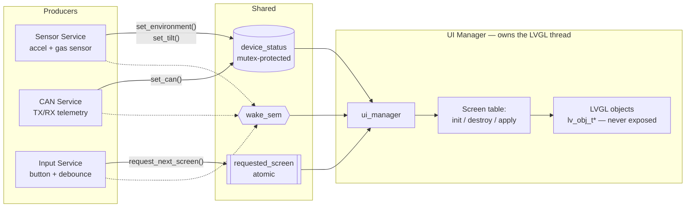
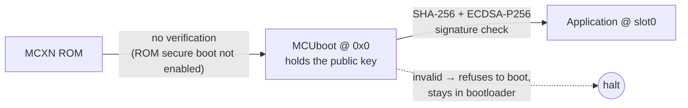

# FRDM-MCXN236 Sensor Hub — UI/Threading Architecture

This document describes the target architecture for how the LVGL UI, sensors, CAN, and
input coexist as separate RTOS threads without racing each other or leaking LVGL
internals outside the UI. It complements `ROADMAP.md` (which tracks *what's done*) by
capturing *how the pieces fit together*.

## Problem today

Everything currently runs in `main()`'s single loop: it polls a button, calls an LVGL
screen-change helper directly, then `lv_timer_handler()`, then sleeps. There's no
dedicated LVGL thread, no sensor/CAN thread, no mutex anywhere, and critically **no
component ever pushes live data into a screen's widgets** — the exported UI just sits
there with its static SquareLine placeholder text. That's the gap this architecture
closes, ahead of wiring up the real sensor and CAN work.

## Component map

```mermaid
flowchart LR
    subgraph Producers
        SENS[Sensor Service<br/>accel + gas sensor]
        CANS[CAN Service<br/>TX/RX telemetry]
        BTN[Input Service<br/>button + debounce]
    end

    subgraph Shared
        STATE[(device_status<br/>mutex-protected)]
        WAKE{{wake_sem}}
        REQSCR[[requested_screen<br/>atomic]]
    end

    subgraph UIOwner[UI Manager — owns the LVGL thread]
        MGR[ui_manager]
        TABLE[Screen table:<br/>init / destroy / apply]
        LVGL[LVGL objects<br/>lv_obj_t* — never exposed]
    end

    SENS -- "set_environment()<br/>set_tilt()" --> STATE
    CANS -- "set_can()" --> STATE
    BTN -- "request_next_screen()" --> REQSCR
    SENS -.-> WAKE
    CANS -.-> WAKE
    BTN -.-> WAKE

    STATE --> MGR
    REQSCR --> MGR
    WAKE --> MGR
    MGR --> TABLE --> LVGL
```

Nothing outside the `UI Manager` box ever holds an `lv_obj_t*`. Producers only ever
call the manager's opaque setter API and touch `device_status`/`wake_sem` — they never
`#include` a screen header.

## Components

### 1. UI Manager (`ui_manager`)

Owns and is the **only** code that touches `lv_obj_t*`. Responsibilities:

- Runs the dedicated LVGL thread (the one place `lv_timer_handler()` is called).
- Holds the **screen table**: for each of the 6 screens (Splash, Overview, Tilt,
  Environment, Can, Power), a triple of `{init, destroy, apply}` functions plus the
  generated root-object pointer.
- Owns screen switching: destroy the outgoing screen's objects, lazily init the
  incoming one, load it, then immediately "hydrate" it from the latest
  `device_status` snapshot so it never paints blank.
- Exposes an opaque API (setters + navigation request) — this is the *only* header
  any non-UI component includes.

Two SquareLine-generated behaviors already do half this work and should be reused, not
reimplemented:
- The generated screen-change helper already lazily calls a screen's `init()` when its
  root pointer is `NULL`.
- Every generated screen's `destroy()` already nulls its own root pointer and every
  child widget pointer after deleting them.

So "lazy load/destroy" is mostly *correct sequencing* of existing generated calls, not
new LVGL logic.

### 2. Per-screen adapters

One small hand-written module per screen (`ui_adapter_<screen>`), each translating
`device_status` fields into calls on *that screen's* widgets (`lv_label_set_text`,
`lv_slider_set_value`, etc.). These are the only files besides `ui_manager` allowed to
`#include` a generated `screens/ui_scr<Name>.h`.

This split exists because `screens/*.c` are regenerated wholesale on every SquareLine
re-export — hand-written logic must live in new files that survive a re-export, never
inside the generated ones.

An adapter's `apply(state)` function only ever runs while its screen is the active one
— inactive screens do zero work.

### 3. Sensor Service

Owns sampling of the accelerometer + the custom gas sensor (ROADMAP §3/§4/§5). Computes
*derived* UI-relevant state (status enum: OK/WARN/ERROR against thresholds; not raw
ADC counts) once, and pushes it into `device_status` via the UI Manager's setters. The
same `device_status` fields are what the CAN service packs: there is no separate raw
snapshot.

### 4. CAN Service

Owns the FlexCAN TX/RX (ROADMAP §6): reads `device_status` via `device_status_get()`, packs/sends telemetry
frames, and pushes CAN-relevant display fields (loopback status, frame id, tx interval,
tx/rx counters) into `device_status`.

### 5. Input Service

Owns the physical button: GPIO interrupt → debounce → a navigation request. Never
touches LVGL or `device_status`'s data fields directly — it only requests a screen via
the UI Manager's navigation API. This is also the extension point for any future input
source (e.g. a second button, or an accelerometer-tap wake gesture) — each is just
another producer that calls the same navigation API.

## The shared `device_status`

One struct, one mutex, everyone-reads-everyone-writes-their-own-fields. Fields are
grouped into per-section sub-structs, embedded by value:

| Section | Fields | Written by | Screen(s) |
|---|---|---|---|
| `device` | `uptime_s`, `overall_status` | main (uptime), `device_status.c` (overall, derived) | Overview |
| `device` | `active_screen`, `display_sleeping` | UI Manager only | — / sleep overlay |
| `tilt` | `x`, `y`, `z`, `status` | Sensor service | Tilt, Overview (status) |
| `environment` | `value`, `sensor_name`, `channel`, `voltage`, `status` | Sensor service | Environment, Overview (status) |
| `can` | `loopback_ok`, `frame_id`, `tx_interval_ms`, `tx_count`, `rx_count`, `status` | CAN service | Can, Overview (status) |

**Sections are for readability, not locking**: there's still a single mutex over the
whole struct and `device_status_get()` still copies all of it. Embedding by value costs
nothing (no pointers, same layout as a flat struct). All producers are low-rate
(sensor/CAN ~1–10 Hz, button at human speed), so contention is a non-issue regardless.

**Per-section getters** (`device_status_get_device/_tilt/_environment/_can()`) copy just
one section under the same mutex; a consumer that only needs one section uses those, so
it depends only on the fields it reads. `device_status_get()` stays for consumers that
span sections and need them mutually consistent (the Overview screen).

**Setters are fine-grained**, one per producer's data (`set_tilt`, `set_environment`,
`set_can`, ...), not a single "write the whole struct" call — so a caller can only ever
touch the fields it owns, and can't accidentally clobber another producer's fields with
stale/zeroed data.

**Latest-value-wins everywhere, including navigation** — there is deliberately no
message queue and no event history. A dashboard only ever needs to show *current*
truth; the "requested screen" is exactly the same kind of value, not a queued command.

## Synchronization model

- **One `k_mutex`** guards all of `device_status`. A real (priority-inheriting) mutex,
  not a spinlock, because producers (higher priority) and the UI Manager (lower
  priority, see below) contend on it — priority inheritance bounds how long a
  higher-priority producer can be blocked by the UI thread holding the lock. Hard
  rule: never hold this lock across anything LVGL- or driver-related — only across a
  plain struct copy in and out.
- **One binary semaphore** wakes the LVGL thread early when something changed, instead
  of it just free-running or sleeping a fixed period. Giving a semaphore that's already
  "given" is a no-op, so bursts of producer writes between two wakeups coalesce for
  free — exactly the desired "redraw on latest value, no backlog" behavior. A message
  queue, condition variable, or `k_event` were considered and rejected: there's exactly
  one wake *reason* here ("something changed, go re-snapshot"), so their extra
  machinery has no payoff.
- **The requested screen** is a standalone atomic scalar, not a `device_status` field —
  it has no cross-field consistency dependency on anything else, so it doesn't need
  the mutex. This also keeps the button's path lock-free, never contending with
  producers.
- **The rate cap** (so the UI thread doesn't redraw needlessly) is not the semaphore's
  job — a semaphore has no "not yet." It's enforced by clamping the LVGL thread's own
  wait timeout between a floor and ceiling before it blocks on the semaphore. This also
  guarantees LVGL's internal timers/animations still get serviced even with zero
  external wake-ups.

## Screen lifecycle model

1. UI Manager's loop checks the requested-screen atomic against what's currently
   loaded.
2. On a change: destroy the outgoing screen (frees its LVGL objects, nulls its
   pointers), then load the incoming screen (lazily initializes it since its pointer
   is now `NULL`).
3. Immediately after load, snapshot `device_status` under the mutex and run the new
   screen's `apply()` once — this is the "hydration" step that avoids a blank first
   frame.
4. On every subsequent wake (whether from a producer or the rate-cap timeout), only
   the *currently active* screen's `apply()` runs against a fresh snapshot; inactive
   screens do nothing.

Only one screen's LVGL objects exist in memory at a time — this is also expected to
reduce the LVGL heap pressure that previously forced a larger memory pool (today all 6
screens are built up front and kept alive for the app's whole lifetime).

## Threading model

| Thread | Relative priority | Talks to `device_status` as | Notes |
|---|---|---|---|
| Sensor service | highest | producer | Time-sensitive sampling shouldn't be delayed by cosmetic UI work. |
| CAN service | high | producer | Telemetry cadence tolerates more jitter than sampling itself, but still above UI. |
| **UI Manager (LVGL thread)** | **below both producers** | consumer only | Screen-switch/redraw is best-effort by design; the display flush is comparatively slow (GPIO-bitbang panel, no fast-path LUT active on this board's wiring), so it must not be able to delay real sensor/CAN timing. Still well above idle. |
| Input service (button debounce) | runs on the system workqueue | producer (navigation only) | Kept deliberately trivial since it shares a global resource with other subsystems. |

Stack sizes aren't listed here as fixed numbers — they should be derived by measurement
(`CONFIG_THREAD_ANALYZER`) once each service has real code, not guessed up front. The
one existing data point: the current single-threaded `main()` needed its stack bumped
specifically because screen construction ran inline in it — that construction cost
moves to the UI Manager's thread under this architecture, and `main()`'s own stack can
shrink back down once it does.

## Boundary rules (what enforces the encapsulation)

- Sensor/CAN/Input service code includes **only** the UI Manager's public header (and
  the shared state-field type definitions it exposes) — never a screen header, never
  `lvgl.h`.
- Per-screen adapters are the only other code allowed to reach into generated screen
  headers, and only for the one screen they own.
- Nothing outside the UI Manager and its adapters ever sees an `lv_obj_t*`.
- Generated files (`screens/*.c/.h`, the top-level `ui.c/.h`) are treated as
  regenerate-anytime artifacts: all hand-written orchestration lives in new files
  alongside them, never edited into them.

## Boot chain & image security (MCUboot)

The build is a sysbuild with two images: MCUboot and the application. MCUboot runs
first on every reset, verifies the application image in slot0, and jumps to it only if
the verification passes (ROADMAP §7).

```mermaid
flowchart LR
    ROM[MCXN ROM] -- "no verification<br/>(ROM secure boot not enabled)" --> MCUBOOT
    MCUBOOT[MCUboot @ 0x0<br/>holds the public key] -- "SHA-256 + ECDSA-P256<br/>signature check" --> APP[Application @ slot0]
    MCUBOOT -. "invalid → refuses to boot,<br/>stays in bootloader" .-> HALT((halt))
```

### What it is and what it isn't

- **It is** an MCUboot chain of trust. `imgtool` signs the application at build time
  with the private key. MCUboot holds the matching public key, compiled in, and refuses
  any slot0 image that has a bad header, a hash mismatch, or a signature from another key.
- **It is not** TrustZone-M isolation. Upstream Zephyr (v4.4.2, what this project pins)
  has no TF-M secure/non-secure split for the MCXN236: there's no `_ns` board variant
  and no TF-M platform. Everything runs in a single secure world, and MCUboot and the
  app share the same privileges.
- **It is not** anchored in hardware. The MCXN ROM doesn't verify MCUboot (ROM
  secure boot / CMPA key hash isn't provisioned) and SWD stays open. Anyone with a
  debugger can replace MCUboot, its public key, or the whole flash. What this setup
  guarantees is that *software already running on the device* only boots images signed
  by our key, for example after an update over a serial link. It does **not** protect
  against physical access. Closing that gap means provisioning ROM secure boot and
  locking debug, which can be irreversible on this SoC. That's deliberately out of
  scope for a dev board.
- **It is not** confidentiality. Images are signed, not encrypted (encryption is a
  ROADMAP §10 stretch).

### Flash map

The board's default slots (440 KB each) are too small for the signed application, and
in Zephyr v4.4.2 the default slot1 also overlapped `storage_partition` by 8 KB. The
layout is overridden in `app/dts/partitions.dtsi`:

| Partition | Offset | Size | Contents |
|---|---|---|---|
| `boot_partition` | `0x00000` | 80 KB | MCUboot (~35 KB used) |
| `slot0_partition` | `0x14000` | 472 KB | Running application (signed image) |
| `slot1_partition` | `0x8A000` | 472 KB | Update staging (ends at `0x100000`, top of 1 MB flash) |
| ~~`storage_partition`~~ | — | — | Removed. Nothing uses NVS or settings |

**The signed image has only ~8 KB of free space in slot0** (483,328 B slot vs
~475 KB signed image). Every feature that grows the image should be checked against
this limit.

### Build configuration and the two traps

| File | Applies to | Purpose |
|---|---|---|
| `app/sysbuild.conf` | sysbuild | Enables MCUboot, ECDSA-P256, the signing key path |
| `app/dts/partitions.dtsi` | both images | **The only place the flash map is defined** |
| `app/boards/frdm_mcxn236.overlay` | app | `#include`s the partitions |
| `app/sysbuild/mcuboot.overlay` | MCUboot | `#include`s the partitions **and** restores `zephyr,code-partition = &boot_partition` |

1. **The two images get separate devicetrees.** A partition change in the app's board
   overlay alone leaves MCUboot with the old map. MCUboot then sees the image as too
   large for slot0 and rejects it (`Image in the primary slot is not valid!`). That's
   why both overlays include one shared file.
2. **`sysbuild/mcuboot.overlay` replaces MCUboot's own `boot/zephyr/app.overlay`**
   (it becomes MCUboot's `DTC_OVERLAY_FILE`). That file is what sets the
   `boot_partition` chosen node. Without it, MCUboot gets linked at slot0's address
   instead of `0x0`. Check with
   `grep FLASH_LOAD_OFFSET build/*/zephyr/.config`: it should show `0x0` for `mcuboot`
   and `0x14000` for `app`.

### Keys

- `SB_CONFIG_BOOT_SIGNATURE_KEY_FILE` points at `keys/sensor-hub-p256.pem` via
  `${WEST_TOPDIR}`. It has to be an absolute path: MCUboot resolves relative paths
  against its own source dir, not the app's. `keys/` is gitignored, and **the private
  key lives only outside version control, so it needs its own backup**. If it's lost,
  this MCUboot can no longer accept new images, and the only fix is reflashing MCUboot
  with a new key over SWD.
- The public key is compiled into MCUboot, so **changing keys means reflashing
  MCUboot**, not just the app.
- Never ship the MCUboot dev key (`root-ec-p256.pem`): its private half is public in the
  MCUboot repo, so anyone can sign images it accepts.

### Upgrade mode

`MCUBOOT_MODE_OVERWRITE_ONLY` (the board's sysbuild default). A valid image in slot1
is copied over slot0 at reset. There's **no test or revert step**: once copied, the old
image is gone. If a validly signed image misbehaves at runtime, the only way back is
another update.

**Test-and-revert isn't available on this SoC** (checked 2026-10-08, MCUboot v2.4.0).
The MCXN236 flash has a 128-byte write block (`write-block-size = <128>`). MCUboot's
swap modes (move/offset/scratch) fail a static assert that requires a write alignment of
8–32 bytes. Direct-XIP/RAM-load *with revert* also fail, because `imgtool sign` only
accepts `--align` up to 32. That's why the board's `Kconfig.sysbuild` defaults to
overwrite-only. Fallback has to come from elsewhere: MCUboot serial recovery to
re-upload a known-good image, plus downgrade prevention.

### Firmware update path (SMP over UART)

The app runs an MCUmgr/SMP server on the console UART (LPUART4, the MCU-Link VCOM),
shared with logging via `UART_CONSOLE_MCUMGR`. A host tool (`smpmgr`) uploads a signed
image into **slot1** while the app keeps running. Once the image is marked pending,
MCUboot verifies it at the next reset and copies it over slot0.

- **The app is not part of the trust chain.** img_mgmt only checks that the upload
  *looks like* an MCUboot image (header magic). The signature check is MCUboot's. An
  update signed with the wrong key uploads fine and is then rejected and erased by
  MCUboot, and the old app keeps running.
- Cost: about **+16 KB** of app flash (measured 2026-10-08). SMP over USB CDC-ACM was
  measured at about +42 KB, which leaves almost nothing in slot0, so it's deferred.
- Needs `zcbor` in the `west.yml` allowlist. Without it, MCUmgr gets silently disabled
  with only a Kconfig warning.

### Verified behavior

| Board has MCUboot with | Image | Delivered via | Result |
|---|---|---|---|
| dev key | dev key | debugger | boots |
| dev key | project key | debugger | rejected: `Image in the primary slot is not valid!` |
| project key | project key | debugger | boots |
| project key | project key, newer version | SMP + mark pending | copied slot1 → slot0, new version boots |
| project key | dev key | SMP | upload accepted. At reset: `Swap type: test` → `Image in the secondary slot is not valid!`, slot1 erased (silently), **old app keeps running** (`Image version: v0.3.1`) |
| any | partition map mismatch between images | debugger | rejected (trap 1 above) |

Recovery from any rejected image: `west flash --domain app` with a correctly signed
build, or `west flash` to rewrite both images. SWD is always available. Step-by-step
procedures for all of the above are in [docs/secure-boot.md](docs/secure-boot.md).

## Known follow-ups / open questions

- The display's GPIO-bitbang flush cost is currently unmeasured; the rate-cap floor
  chosen for the UI thread's wait timeout should be validated against a real measured
  flush duration before being trusted as an actual cap (if the flush alone exceeds the
  floor, the floor is meaningless and the flush itself is the limiting factor).
- Power management (ROADMAP §8) will add a sleep/wake path; this architecture's
  navigation model (a single atomic "requested screen" plus a wake semaphore) should
  extend naturally to "wake on button/motion → force Overview" without new primitives,
  but hasn't been designed in detail yet.
- **Reviewed 2026-08-04, per-screen adapter pass (ROADMAP §2):** `ui_manager.c` doesn't
  actually call `device_status_wait()` yet — the LVGL thread free-runs on an
  unconditional `k_msleep(10)` instead of blocking on the coalescing semaphore with a
  clamped floor/ceiling. Also, `scrSplash_postinit`/`scrOverview_postinit`/
  `scrOverview_step` are currently defined inline in `ui_manager.c` (which
  `#include`s `ui.h` directly) rather than in per-screen adapter files — both should be
  fixed as part of implementing the remaining adapters, not deferred further.
- The Power screen needs the sleep/wake flag (`s_display_sleeping` in `ui_manager.c`) to
  drive its hero/instructions text, but that flag is UI-Manager-local state, not a
  `device_status` field — it needs a small read accessor (e.g.
  `ui_manager_display_sleeping()`) rather than being routed through the mutex.
- Tilt's `ui_axisXbar/Ybar/Zbar` are `lv_slider`s in `LV_SLIDER_MODE_RANGE` (a start
  *and* end value), not a plain single-value slider — undecided whether that's
  intentional (e.g. start pinned at 0, end at the reading, to visualize
  deviation-from-center) or should collapse to a single value before the Tilt adapter
  is written.
- ~~`device_status`'s CAN fields have no `can_rx_count`~~ — resolved: `rx_count` added to
  the `can` section and `device_status_set_can()`; the CAN service counts looped-back
  telemetry echoes into it.
